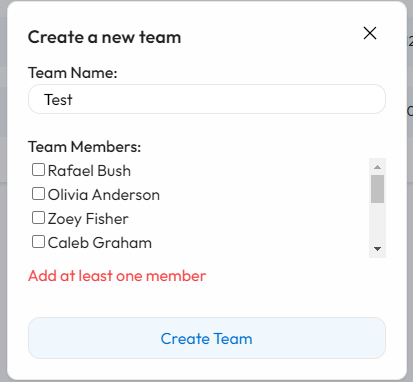
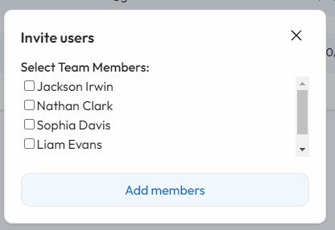
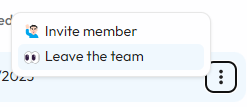
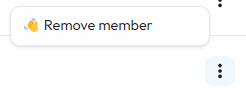

# teams-table-test-project

Demo: https://yura-kiv.github.io/teams-table-test-project/

Для запуску проекту виконати команду `npm run dev`

При реалзіації намагався питсати всі компоненти самостійно, також власноруч писав стилі використовуючи лише scss, для якогомога ближчого співставлення з макетом.

## Генерація початкових даних

Початкові дані я генерую в `helpers/getInitialData.ts`, де я заповнюю teams початковою інформацією за допомогою методів.

При ініціалізації застосунку в слайсі `teams.slice.ts` та `users.slice.ts` я присвоюю початкові значення для користувачів на наповення команд.

## Models

Моделі даних для Team та User можна знайти в папці `models`.

## Користувач

Також мені було цілком логічно зробити ще один слайс для аккаунту користувача: `account.slice.ts` - де я ініціалізую користувача з заготовки (першого: `users[0]`). При переході на Tab - Account можна побачити інформацію та відповідно розлогінитись.

## Таблиці

Всього в заготовці використовується три команди, але в одній із команд нашого коритсувача немає, і відповідно її ми відсіємо та не будемо показувати для нашого користувача.

### Сортування

Сортування доступні на стовпцях біля яких є позначка "стрілочок", ці стрілочки також вказують на напрям сортування.

Сортування відбувається по полям head-a TeamsTable або MembersTable за допомогою кастомного хука `useSortParams`, який конфігурується відносно даних.

### Форми для створення

При створенні форм я використовував yup та formik для валідації даних.

Форма для створення команди з мультиселектом.

Форма для творення команди з мультиселектом.

Форма для запрошення користувачів.

### Dropdown

Для Dropdown було створено окремий перевикористовуваний компонент.

### Видалення користувача

При видаленні користувача з команди виконується перевірка на те чи не видаляє користувач (авторизований) сам себе, якщо так то він виходить з команди.

